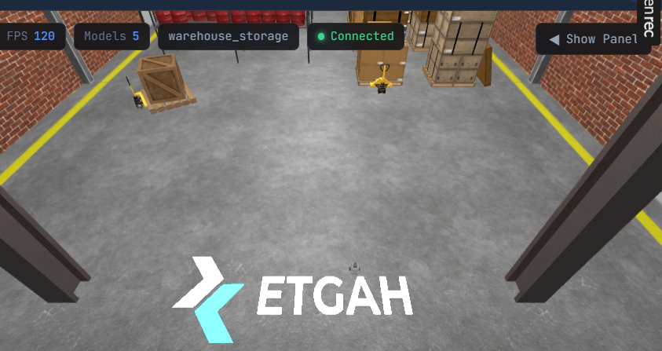
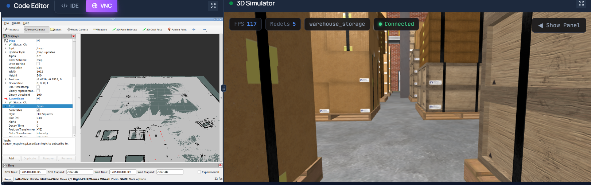
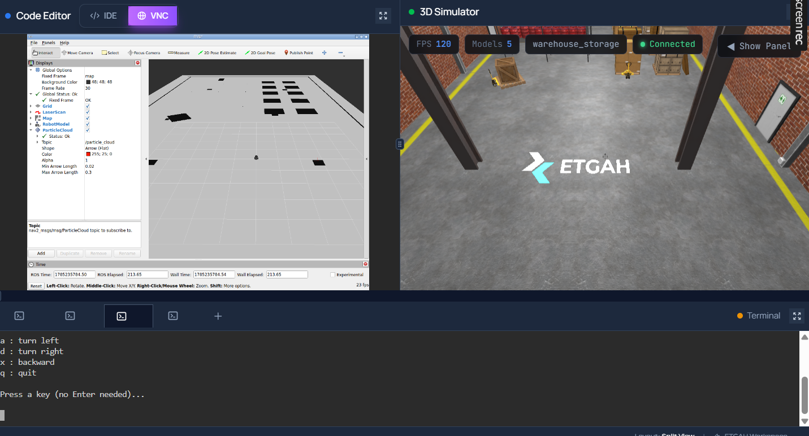
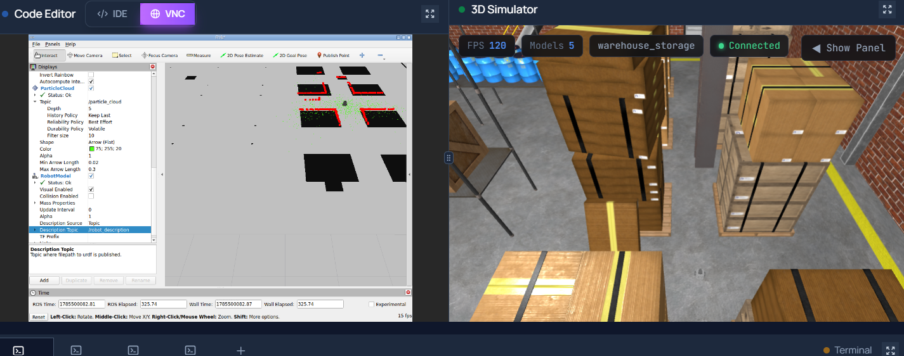
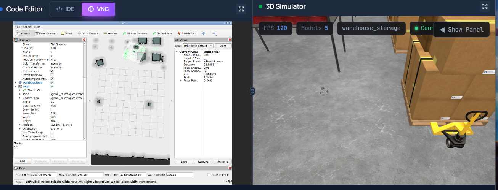
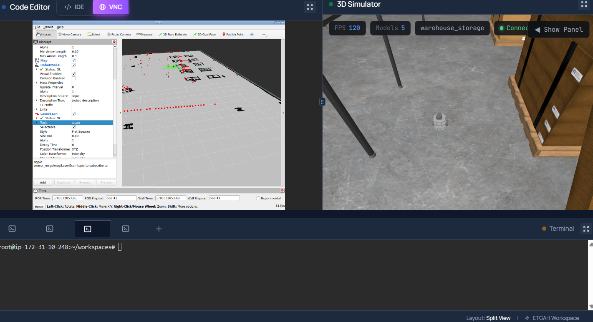

# Warehouse Waypoint Navigation — Autonomous TurtleBot3 Delivery Robot

An autonomous mobile robot project built on **ROS 2 (Jazzy)** and **Gazebo Sim**, in which a **TurtleBot3 Burger** (with a modified LiDAR configuration) maps a simulated warehouse using **SLAM Toolbox**, localizes itself with **AMCL**, and then autonomously completes a multi-stop delivery mission using **Nav2** — while displaying live, color-coded waypoint markers in **RViz**.

The robot starts at a **Charging Station (Home)**, drives to a **Loading Station** (waiting there 30 seconds), continues to a **Storage Area**, then a **Shipping Station**, and finally returns Home — all goals sent sequentially through Nav2's `NavigateToPose` action, with the mission halting and reporting the failed location if any goal is not reached.

<p align="center">
  
</p>

---

## Table of Contents

1. [Project Overview](#1-project-overview)
2. [Repository Structure](#2-repository-structure)
3. [What Each Package and File Does](#3-what-each-package-and-file-does)
4. [Workspace Build Instructions](#4-workspace-build-instructions)
5. [Stage 1 — Launching the Warehouse World with TurtleBot3](#5-stage-1--launching-the-warehouse-world-with-turtlebot3)
6. [Stage 2 — Mapping with SLAM Toolbox](#6-stage-2--mapping-with-slam-toolbox)
7. [Stage 3 — Localization with AMCL](#7-stage-3--localization-with-amcl)
8. [Stage 4 — Nav2 Bringup (Full Navigation Stack)](#8-stage-4--nav2-bringup-full-navigation-stack)
9. [Stage 5 — RViz Setup and Required Topics](#9-stage-5--rviz-setup-and-required-topics)
10. [Stage 6 — Running the Autonomous Waypoint Mission](#10-stage-6--running-the-autonomous-waypoint-mission)
11. [Waypoint Names, Positions, and Orientations](#11-waypoint-names-positions-and-orientations)
12. [RViz Waypoint Marker Behavior](#12-rviz-waypoint-marker-behavior)
13. [Problems Encountered and Solutions](#13-problems-encountered-and-solutions)
14. [Full Demo Videos](#14-full-demo-videos)

---

## 1. Project Overview

This project combines four core robotics capabilities into one working pipeline:

| Stage | Package | Purpose |
|---|---|---|
| **World** | `warehouse_world` | The simulated warehouse environment: floor, walls, shelving, pallets, pillars, and Gazebo Sim models (Depot, ETGAH logo) |
| **Robot** | `turtlebot3_gazebo` | A modified TurtleBot3 Burger description with an adjusted LiDAR configuration (14 m range) used for mapping and navigation |
| **SLAM / AMCL / Nav2** | `robot_navigation` | All mapping, localization, and navigation configuration, launch files, the saved map, and the mission/marker scripts |
| **(reserved)** | `warehouse_waypoints` | Placeholder package for future waypoint-related utilities |

**`warehouse_with_robot.launch.py`** is the key file tying the first two together: it brings up the `warehouse_world` Gazebo Sim environment **and** spawns the modified `turtlebot3_gazebo` robot into it in a single launch, so the world and the robot always come up together as one step.

---

## 2. Repository Structure

```
warehouse-waypoint-nav/
├── src/
│   ├── robot_navigation/
│   │   ├── config/            # amcl.yaml, costmap.yaml, planner/controller/behavior/bt_navigator yaml
│   │   ├── img/                # screenshots used in this README
│   │   ├── launch/
│   │   │   ├── warehouse_with_robot.launch.py   # world + robot spawn, together
│   │   │   ├── slam.launch.py                   # SLAM Toolbox (mapping mode)
│   │   │   ├── slam_sync_test.launch.py         # SLAM sync diagnostic/test launch
│   │   │   ├── localization.launch.py           # map_server + AMCL only
│   │   │   ├── navigation.launch.py             # Nav2 servers only
│   │   │   └── bringup.launch.py                # full Nav2 stack (map_server + AMCL + all Nav2 servers)
│   │   ├── maps/                # warehouse_map.yaml + warehouse_map.pgm (the saved SLAM map)
│   │   ├── posegraph/           # serialized SLAM Toolbox pose graph (for resuming/re-localizing mapping sessions)
│   │   ├── rviz/                # saved RViz display configuration
│   │   ├── scripts/
│   │   │   ├── waypoint_mission.py    # sends the 4 sequential Nav2 goals
│   │   │   └── waypoint_markers.py    # publishes the color-coded MarkerArray
│   │   ├── video/               # demo videos/gifs used in this README
│   │   ├── CMakeLists.txt
│   │   └── package.xml
│   │
│   ├── turtlebot3_gazebo/       # modified TurtleBot3 Burger description (LiDAR range adjusted to 14 m)
│   ├── warehouse_waypoints/     # reserved package (currently unused / future expansion)
│   └── warehouse_world/         # ETGAH-provided warehouse world, models, and world-level Gazebo bridge config
│
└── README.md
```

---

## 3. What Each Package and File Does

### `warehouse_world`
The base simulation environment.
- **`worlds/warehouse_storage.sdf`** — the warehouse SDF world: floor, walls, shelving, pallet boxes, pillars, stairs.
- **`models/`** — the `Depot` structure model and the `etgah_logo` decal, included into the world via `<include>` tags.
- **`config/gz_bridge_ros.yaml`** — bridges Gazebo's simulated `/clock` to ROS 2, keeping every `use_sim_time` node correctly synchronized.

### `turtlebot3_gazebo`
A modified copy of TurtleBot3 Burger's Gazebo description.
- LiDAR sensor range extended to **14 m** (from the stock Burger's 3.5 m) to give SLAM/AMCL/Nav2 more usable scan data across the warehouse's larger open areas.
- Contains the robot's URDF/Xacro, meshes, and Gazebo Sim plugin definitions (DiffDrive, JointStatePublisher, OdometryPublisher, LiDAR sensor).

### `robot_navigation`
All SLAM, localization, navigation configuration/launch files, the saved map, and the mission logic scripts.

**Launch files:**
- **`warehouse_with_robot.launch.py`** — brings up the `warehouse_world` environment and spawns the `turtlebot3_gazebo` robot into it together, in one command. This is the entry point for every session.
- **`slam.launch.py`** — launches SLAM Toolbox in online-asynchronous (mapping) mode.
- **`slam_sync_test.launch.py`** — a diagnostic launch used to test/verify SLAM Toolbox's time-sync (`/clock`, TF timing) behavior in isolation.
- **`localization.launch.py`** — launches `map_server` + `AMCL` only, for testing localization on its own before running full Nav2.
- **`navigation.launch.py`** — launches the Nav2 planning/control servers only (assumes localization is already running separately).
- **`bringup.launch.py`** — the full stack in one launch: `map_server`, `amcl`, `planner_server`, `controller_server`, `behavior_server`, `bt_navigator`, all managed by one `lifecycle_manager_navigation`.

**Config files:**
- **`amcl.yaml`** — AMCL's particle filter, laser model, and initial pose parameters.
- **`costmap.yaml`** — local and global costmap layers (obstacle layer, inflation layer) used by the planner/controller.
- **`planner_server.yaml` / `controller_server.yaml` / `behavior_server.yaml` / `bt_navigator.yaml`** — Nav2's core planning, path-following, recovery-behavior, and behavior-tree configuration.

**Other folders:**
- **`maps/`** — the final SLAM-built occupancy grid map (`.yaml` + `.pgm`) used for localization and navigation.
- **`posegraph/`** — SLAM Toolbox's serialized pose graph, allowing a mapping session to be resumed or reused without remapping from scratch.
- **`rviz/`** — a saved RViz configuration with Map, LaserScan, RobotModel, TF, Costmaps, and the waypoint markers pre-added.

**Scripts (`scripts/`):**
- **`waypoint_mission.py`** — sends each of the 4 waypoints to Nav2's `navigate_to_pose` action **sequentially**, waiting for each result before sending the next goal. Waits exactly 30 seconds at the Loading Station. On failure, stops the mission and reports which waypoint failed (`ON_FAILURE = 'stop'`). Publishes the active waypoint's name on `/mission_status`.
- **`waypoint_markers.py`** — subscribes to `/mission_status` and publishes a `visualization_msgs/msg/MarkerArray` on `/waypoint_markers`, drawing all 4 named locations as labeled spheres — blue when inactive, green when it's the currently active navigation goal.

### `warehouse_waypoints`
Currently reserved for future expansion (not actively used by the running pipeline — all mission logic currently lives in `robot_navigation/scripts/`).

---

## 4. Workspace Build Instructions

```bash
mkdir -p ~/workspaces/turtlebot_ws/src
cd ~/workspaces/turtlebot_ws/src

git clone https://github.com/NadineMohammed/warehouse-waypoint-nav.git temp_clone
cp -r temp_clone/src/warehouse_world .
cp -r temp_clone/src/turtlebot3_gazebo .
cp -r temp_clone/src/robot_navigation .
cp -r temp_clone/src/warehouse_waypoints .
rm -rf temp_clone

cd ~/workspaces/turtlebot_ws
colcon build
source install/setup.bash

export TURTLEBOT3_MODEL=burger
```

---

## 5. Stage 1 — Launching the Warehouse World with TurtleBot3

```bash
cd ~/workspaces/turtlebot_ws
source install/setup.bash
export TURTLEBOT3_MODEL=burger
ros2 launch robot_navigation warehouse_with_robot.launch.py
```

This single launch file starts Gazebo Sim with the `warehouse_world` environment loaded, and spawns the modified `turtlebot3_gazebo` robot (14 m LiDAR range) into it at the Home position.

Verify sensors and topics are live:

```bash
ros2 topic list
# /scan  /odom  /cmd_vel  /tf  /joint_states  /clock
```

<p align="center">
  
</p>

---

## 6. Stage 2 — Mapping with SLAM Toolbox

```bash
# Terminal 1 — already running from Stage 1

# Terminal 2
ros2 launch robot_navigation slam.launch.py

# Terminal 3 — teleoperate the robot through every aisle
python3 src/robot_navigation/scripts/simple_teleop.py
```

Drive slowly and smoothly through every aisle, corner, and open area, occasionally revisiting already-mapped sections to give SLAM Toolbox loop-closure opportunities.

<p align="center">
  
</p>

<p align="center">
  
</p>

Once complete, view the finished map in RViz:

<p align="center">
  
</p>

**Save the map:**

```bash
ros2 run nav2_map_server map_saver_cli -f src/robot_navigation/maps/warehouse_map
```

**Save the SLAM Toolbox pose graph** (allows resuming this mapping session later, or reusing it directly):

```bash
ros2 service call /slam_toolbox/serialize_map slam_toolbox/srv/SerializePoseGraph \
  "{filename: '/root/workspaces/turtlebot_ws/src/robot_navigation/posegraph/warehouse_map'}"
```

---

## 7. Stage 3 — Localization with AMCL

```bash
ros2 launch robot_navigation localization.launch.py
```

Set the initial pose (2D Pose Estimate in RViz, or):

```bash
ros2 topic pub /initialpose geometry_msgs/msg/PoseWithCovarianceStamped \
  "{header: {frame_id: 'map'}, pose: {pose: {position: {x: 0.0, y: 0.0, z: 0.0}, orientation: {w: 1.0}}}}" --once
```

Confirm the laser scan aligns with the map walls and the particle cloud converges tightly around the robot:

<p align="center">
  
</p>

<p align="center">
  
</p>

Confirm the transform chain and live pose updates:

```bash
ros2 run tf2_tools view_frames
ros2 topic echo /amcl_pose
```

---

## 8. Stage 4 — Nav2 Bringup (Full Navigation Stack)

```bash
ros2 launch robot_navigation bringup.launch.py
```

This single launch file starts `map_server`, `amcl`, `planner_server`, `controller_server`, `behavior_server`, and `bt_navigator`, all managed by one `lifecycle_manager_navigation`. Use this instead of `localization.launch.py` + `navigation.launch.py` separately once both are confirmed working on their own.

Before running the automated mission, send one manual **2D Goal Pose** in RViz to confirm the robot plans and drives there safely:

<p align="center">
  
</p>

<p align="center">
  
</p>

<p align="center">
  
</p>

---

## 9. Stage 5 — RViz Setup and Required Topics

Open RViz (or load the saved config in `src/robot_navigation/rviz/`), set **Fixed Frame** to `map`, and add the following displays:

| Display | Topic | Recommended QoS | Why |
|---|---|---|---|
| Map | `/map` | **Durability: Transient Local**, Reliability: Reliable | The map is published once (or on update) and must be available to late-joining subscribers (like RViz opening after SLAM/map_server already started) |
| LaserScan | `/scan` | Durability: Volatile, Reliability: **Best Effort** | Matches the sensor's own QoS — high-frequency data where the latest reading matters more than guaranteed delivery of every single scan |
| RobotModel | `/robot_description` | Durability: **Transient Local** | The URDF is published once at startup; late subscribers still need to receive it |
| TF | `/tf` | Durability: Volatile, Reliability: Reliable | Continuously updating transform tree |
| TF (static) | `/tf_static` | Durability: **Transient Local** | Fixed transforms (e.g., sensor mounting offsets) published once |
| Global Costmap | `/global_costmap/costmap` | Durability: Transient Local | Published on change, late subscribers need the current costmap |
| Local Costmap | `/local_costmap/costmap` | Durability: Volatile | Frequently updated rolling window around the robot |
| MarkerArray (waypoints) | `/waypoint_markers` | Durability: **Transient Local** (set explicitly in `waypoint_markers.py`) | Ensures RViz displays the markers immediately even if it subscribes after the mission has already started |
| PoseArray (AMCL particles) | `/particle_cloud` | Durability: Volatile | Continuously updating particle filter visualization |

Confirm all expected topics are present:

```bash
ros2 topic list
```

Expected (once world+robot+SLAM/AMCL+Nav2+mission scripts are all running):

```
/map
/map_metadata
/scan
/odom
/cmd_vel
/tf
/tf_static
/joint_states
/clock
/amcl_pose
/particle_cloud
/global_costmap/costmap
/local_costmap/costmap
/plan
/mission_status
/waypoint_markers
```

<p align="center">
  
</p>

---

## 10. Stage 6 — Running the Autonomous Waypoint Mission

With Nav2 bringup already running (Stage 4) and the robot localized:

```bash
# Terminal A — run the mission
ros2 run robot_navigation waypoint_mission.py

# Terminal B — run the marker publisher
ros2 run robot_navigation waypoint_markers.py
```

The robot drives Home → Loading Station (30s wait) → Storage Area → Shipping Station → Home, sending each goal only after the previous one completes.

<p align="center">
  
</p>

---

## 11. Waypoint Names, Positions, and Orientations

All poses were recorded in the `map` frame by driving the robot to each physical location (with AMCL localization confirmed stable) and reading:

```bash
ros2 run tf2_ros tf2_echo map base_footprint
```

| Waypoint | Role | x (m) | y (m) | yaw (rad) |
|---|---|---|---|---|
| **Charging Station (Home)** | Mission start and final destination | 0.000 | 0.000 | 0.000 |
| **Loading Station** | Wait here 30 seconds | 8.540 | -0.694 | -0.187 |
| **Storage Area** | Second navigation goal | 16.704 | -1.156 | -0.125 |
| **Shipping Station** | Third navigation goal | 18.798 | 6.598 | 2.479 |

> Update the table above if you re-record any waypoint — keep `waypoint_mission.py`'s and `waypoint_markers.py`'s `WAYPOINTS` lists in sync with these exact values.

---

## 12. RViz Waypoint Marker Behavior

`waypoint_markers.py` publishes all four waypoints as a `visualization_msgs/msg/MarkerArray` on `/waypoint_markers`, listening to `/mission_status` (published by `waypoint_mission.py`) to know which goal is currently active.

| State | Color |
|---|---|
| Inactive waypoint | 🔵 Blue |
| Currently active navigation goal | 🟢 Green |

Each marker is a `SPHERE` at the waypoint's recorded pose, with a `TEXT_VIEW_FACING` label above it showing the station name. The entire `MarkerArray` is republished every time the active goal changes, so RViz shows mission progress live.

---

## 13. Problems Encountered and Solutions

| Problem | Cause | Solution |
|---|---|---|
| Duplicate `/cmd_vel` publishers, `TwistStamped` vs `Twist` mismatch | TurtleBot3's own spawn launch file started a second `ros_gz_bridge` publishing `TwistStamped`, alongside our own bridge expecting plain `Twist` | Created a local copy of the spawn launch file with the redundant bridge removed; centralized all topic bridging into one `gz_bridge_ros.yaml` |
| Duplicate `/clock` publishers causing `tf2_buffer: Detected jump back in time` and dropped scan messages | Two independent bridge nodes both relaying Gazebo's clock | Same centralized-bridge fix; fully killed leftover background `ros2`/`gz` processes between test runs |
| `Mapper FATAL ERROR - unable to get pointer in probability search!` (SLAM Toolbox crash) | SLAM resolution set too fine (0.03) combined with a wide correlation search space, causing an internal grid indexing overflow | Reverted `resolution` to `0.05` and reduced `correlation_search_space_dimension` |
| Map showing unconverged/speckled patches in large open areas despite repeated passes | Large open, feature-poor areas give scan matching little to lock onto; loop closure thresholds were too strict | Extended LiDAR range to 14 m in the modified `turtlebot3_gazebo` description, loosened loop-closure response thresholds slightly, and adjusted driving technique to hug visible features rather than crossing open space directly |
| RViz `RobotModel` showing "No transform from [X] to [map]" for every link | SLAM Toolbox / AMCL not yet active in that session | Confirmed `ros2 node list` includes `/slam_toolbox` or `/amcl` before expecting TF to resolve |
| Nav2 goals aborting instantly with status code 6 (ABORTED) | AMCL had not been given a correct initial pose before the mission script ran | Always publish `/initialpose` immediately after bringup, before sending any navigation goals |
| Keyboard teleop tools not responding to keypresses in the cloud terminal | Cloud/browser terminal did not reliably relay raw keypress input | Wrote a custom teleop node using `tty.setraw()` for direct single-keypress capture, confirmed with a standalone raw-input test first |

---

## 14. Full Demo Videos

| Stage | Video |
|---|---|
| Mapping the warehouse (SLAM Toolbox) | `src/robot_navigation/video/MappingPhaseSpeeded.mp4` |
| Path planning test | `src/robot_navigation/video/PathTestSpeeded.mp4` |
| Manual 2D Goal Pose navigation test | `src/robot_navigation/video/NavTestGoalSpeeded.mp4` |
| Full autonomous waypoint mission | `src/robot_navigation/video/WayPointMissionSpeeded.mp4` |

---

## License

This project was completed as part of the ROS 2 Masterclass final project on the ETGAH platform.
